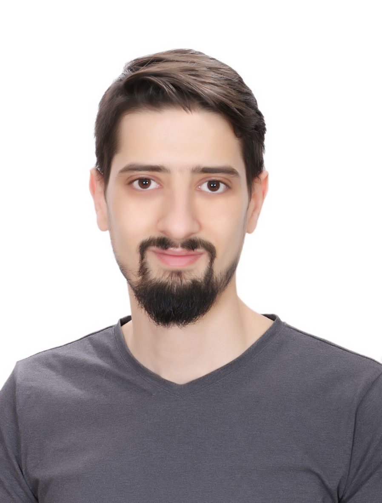

# Mohammad Abdul Ghafour - Portfolio 
Auto Control & Computers Engineer / Web Developer

I’m an Auto Control & Computers Engineer / Web Developer I'm passionate about coding and solving problems.

[Portfolio Deployed URL](https://mohammad-abdul-ghafour-portfolio.netlify.app)

## Info :
* Tabarbour, Amman, Jordan
* 09 of February 1994
* Married
* 00962 799097758
* Mohammad1478971539@gmail.com
* https://github.com/Mohammad-Abdul-Ghafour
* https://www.linkedin.com/in/mohammad-abdul-ghafour/

## TECHNICAL SKILLS :

### Languages :
* Arabic ( Mother Tongue )
* English

### Skills and Tools :
* HTML5, CSS3,  JavaScript, React.js.
* Git, GitHub, VS Code, Netlify.

### PROJECTS :

1. Horned-Beast React Project: August 2021
    * An React application to display gallory of image and interact by adding like and open the image in modal using bootstrap
    * [Horned-Beast Netlify Deployed URL](https://horned-beast-mnb.netlify.app)
    * [Horned-Beast Github Link](https://github.com/Mohammad-Abdul-Ghafour/horned-beasts)

2. Hand2Hand Project: August 2021
    * A store application where you can buy and sell homemade products.
    * Final Week Project of Code 201/LTUC development course. 
    * [Hand2Hand Github Live URL](https://sad-co-software-application-development.github.io/Hand2Hand/)
    * [Hand2Hand Github Link](https://github.com/SAD-co-Software-Application-Development/Hand2Hand)

3. Bus-mall Project: August 2021
    * An application to show data of what might people like for a bus-mall project.
    * Used ChartJs to show the number of clicked and displayed products.
    * [Bus-mall Github Live URL](https://mohammad-abdul-ghafour.github.io/Bus-Mall/)
    * [Bus-mall Github Link](https://github.com/Mohammad-Abdul-Ghafour/Bus-Mall)

4. Salmon-Cookies Project: August 2021 
    * Adaptable application for new Salmon-Cookies business with the ability to add and remove the locations of the stores
    * Used Local Storage to store, get and delete items.
    * [Salmon-Cookies Github Live URL](https://mohammad-abdul-ghafour.github.io/Salmon-Cookies/)
    * [Salmon-Cookies Github Link](https://github.com/Mohammad-Abdul-Ghafour/Salmon-Cookies)

### EXPERIENCE :
1. Mn Al Akher, Tabarbure-Jordan, Social Media & designer, Augast 2019 – June 2021
    * Photoshop designer.
    * Social media manager.
2. Zinou Pack, Al Khartoum-Sudan, April 2018 – January 2019 
    * PLC programming.
    * Machine manufacturing and maintenance.
    * Establishment of factories and maintenance.

### EDUCATION :
1. Luminus College and University,  Tabarbure-Jordan, 2021
    * Trainee - Advanced Software Development in Full-Stack JavaScript
2. Al-Baath University, Homes-Syria, September 2012 - June 2017
    *   Auto Control & Computers Engineer

